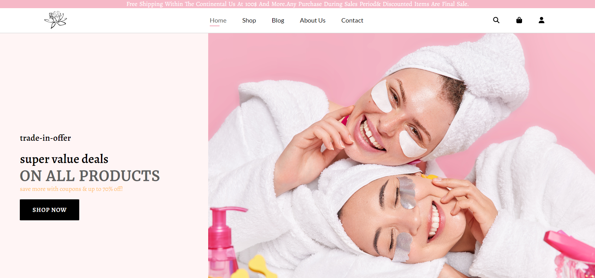

# Ecommerce Beauty Website

Beauty is a trendy, 
responsive Ecommerce  Website with a simple design.
 It is a  HTML5 & CSS eCommerce website that viwe and sell Beauty prodcts . 
It is an eCommerce website with an 
  eye-catching layout and minimal look.
  

 

## Demo
<a href="https://hawra-alramadan.github.io/Ecommerce-beauty/" > Demo</a>
## Features


 - About *Us page
 - Shop page
 - Contact page
 - Blog page
 - Fully Responsive Base Theme (Demo) 
 - Social Icons 
 - Font Awesome
 - Footer navigation
 - Newsletter subscription in Home page
 - Free & Automatic Hosting with GitHub Pages 


## Install Locally

Clone the project

```bash
  git clone https://github.com/hawra-alramadan/Ecommerce-beauty.git
```

Go to the project directory

```bash
  cd Ecommerce-beauty
```


## Authors

 [hawra-alramadan](https://github.com/hawra-alramadan)


## Acknowledgements

 - [Awesome Readme Templates](https://awesomeopensource.com/project/elangosundar/awesome-README-templates)
 - [Awesome README](https://github.com/matiassingers/awesome-readme)
 - [How to write a Good readme](https://bulldogjob.com/news/449-how-to-write-a-good-readme-for-your-github-project)


## License


[](License.txt)
